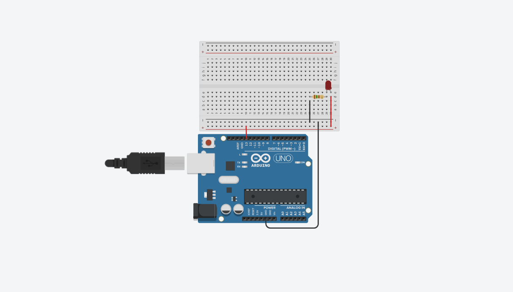

<h2 align="center">
    </br>
    <br> Missao Arduino </br>
</h2>

> O Arduino é uma placa microcontroladora programável de código aberto, projetada para criar projetos eletrônicos interativos, acessíveis tanto em preço quanto em nível de dificuldade. Sua plataforma permite a criação de uma grande variedade de projetos, como robôs, sensores, dispositivos de IoT e outros. 

 </igm>
>Tinkercad Link: https://www.tinkercad.com/things/l59BRV1MPYP

### 🎯 Desafio da Missao
- Montar o circuito para acender um LED com Arduino em uma protoboard no TinkerCAD;
- Dimensionar o resistor ideal para a cor do LED escolhida;
- Programar o Arduino para piscar um LED com 3 períodos de tempo diferentes.

### 📒 Steps
1. Nesse pequeno projeto foi usado um Arduino, foi usado:
    1. Arduino;
    2. Protoboard;
    3. LED vermelha (2,0V);
    4. Resistor (150R);
    5. Fios.
2. Primeiramente, e' necessario energizar a placa. Para isso, conectei um fio saindo do terminal GND do Arduino at'e o polo negativo da protoboard, caracterizando um fio terra. Ap'os isso, liguei um fio, saindo de um terminal qualquer (usei o 13), ate' o polo positivo da protoboard.
3. A seguir, e' de suma importancia escolher um resistor que consiga suportar a voltagem vinda da protoboard. Entao, tendo em vista que o arduino fornece 5V a palca quando enviamos um sinal HIGH e que a led vermelha tem uma tensao maxima de 2 volts e corrente de ate' 20 Miliamperes, calueia resistencia do resistor atraves da formula:

$$
R = (Valimentacao - Vled)/CorrenteLed
$$
<ul>
    <em> Valimentacao = 5V; </em><br>
    <em> Vled = 2V; </em><br>
    <em> CorrenteLed = 0,020A; </em>
    
</ul>
4. Por isso, liguei um fio partindo do polo negativo da placa ate' a ponta de um resistor com 150R. Nesse sentido, a outra ponta do resistor foi ligada ao catodo luz led.
5. Em seguida, conectei a o anodo da luz de lede ao polo positivo da placa.
6. Ao final, escrevi o seguinte codigo em c++ para o funcionamento da placa:


``` cpp
#define LED1 13         // numero do terminal do arduino conectado a protoboard
int interval = 1000;    // delay inicializado em 1000 millisegundos (s)	

void setup()
{
  pinMode(LED1, OUTPUT);
}

void loop()
{
  
  digitalWrite(LED1, HIGH); // Apaga LED1
  delay(interval); // Aguarda o valor do intervalo em millisegundos(s)
  
  digitalWrite(LED1, LOW); // Ascende LED1
  delay(interval); // Aguarda o valor do intervalo em millisegundos(s)
   
  // Ascende em 3 intervalos diferentes
  interval += (interval < 3000) ? 1000 : -2000;
}
```
