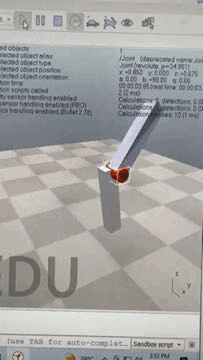

# INACABADO

<h2 align="center">
     
      Missão CoppeliaSIM  
</h2>

</igm>

> CoppeliaSim é um software de simulação utilizado na área de robótica e engenharia, que permite aos desenvolvedores criar e testar modelos virtuais de robôs e sistemas mecatrônicos de forma precisa e eficiente. Ele possuí uma interface gráfica para a criação e execução das simulações, além de aceitaer o input de scripts de diversas linguagens de programação a partir do usuário.

### 🎯 Desafio da Missão
- Criar uma cena;
- Construir um pêndulo com os elementos básicos:
    - Blocos sólidos;
    - Junta de revolução.

### 📒 Steps
1. À princípio, criei um retângulo estático utilizando uma forma simples para servidor de ponto de apoio do pêndulo desejado.
2. A seguir, adicionei uma junta de revolução no topo do retângulo anteriror. Tal dispositivo possibilita a rotação do próximo objeto posto à junta.
3. Nesse sentido, uni um outro retângulo à junta de revolução para caracterizar um verdadeiro pêndulo. 
4. Por fim, inclina-se o primerio objeto para que o sistema entre em desequilíbrio inicial, garantindo o início do movimento pêndular
