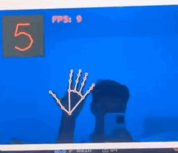
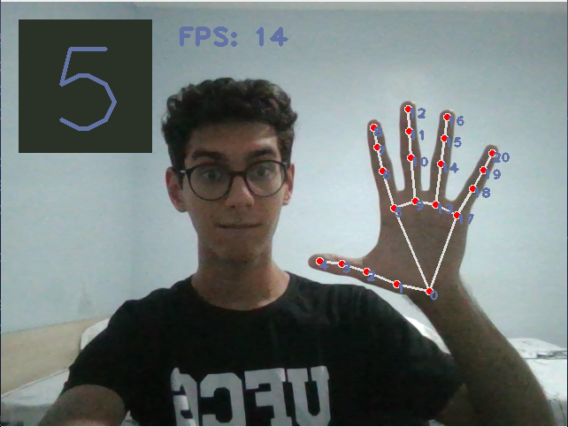

<h2 align=center>
    </br>
    </br>
    <br> Missão HandTracking </br>
</h2>

<h2 align=center>
    </igm>
    </img>
</h2>


>A biblioteca OpenCV é uma biblioteca em cóigo aberto voltada à visão computacional. 
Ela pode ser utilizada para análise de imagens, detecção de objetos, reconhecimento de rostos, rastreamento de objetos, entre outras;

>Nesse mesmo âmbito, a biblioteca Mediapipe também atua nesse meio, porém, ela oferece algumas ferramentas e recurso pré-prontos adicionais, os quais diminuiem a abstração do código, permitindo a redução do tempo gasto processando v

### 🎯 Desafio da Missão
- Criar uma aplicação com OpenCV que representa números utilizando os dedos da mão.

### 📓 Requisitos
- Para este projeto, é necessário o uso das bibliotecas open-cv, media-pipe e time (nativa da linguagem Python):
```bash
pip install opencv-python
pip install mediapipe
```

### 📒 Steps
1. De início, criei uma [venv](https://docs.python.org/3/library/venv.html) para conteinerizar a biblioteca instalada, permitindo a portabilidade e o versionamento dos códigos a seguir;

2. À princípio, importei as bibliotecas descritas anteriormente:
```python
# Bibliotecas ###################################################
import mediapipe as mp
import cv2 as cv
import time
```

3. Partindo para o código da atividade, criei algumas variáveis globais que auxiliaram a enxugar o código, tornando-o mais legível:
```python
    # Variaveis Globais #########################################
    t0,t1 = 0,0                 # variaveis de tempo inicial e 
                                # final usadas para calcular fps
                                # do video
                                    
    
    frame = cv.VideoCapture(0)  # cria um objeto que receberá o 
                                # video obtido da primeira camera 
                                # disponivel no computador 
                                # (por isso o '0').
    
    color_text = (85,85,255)        # cor do texto 
    color_background = (40,50,42)   # cor do quadrado
    
    # Shortcuts para metodos das bibliotecas ####################
    hands = mp.solutions.hands      # configura a biblioteca do
                                    # mediapiepe para usar 
                                    # funcoes relacionadas a maos

    Hands = hands.Hands(max_num_hands=1)    # quantidade maxima 
                                            # de maos que serao 
                                            # detectadas

    mpDwaw = mp.solutions.drawing_utils # configuracao da
                                        # biblioteca do mediapipe
                                        # para funcoes
                                        # relacionadas a desenhos
```

4. A seguir, capturei o vídeo obtido por meio da camera do computdaor e o inverti, para uma maior compreensão:
```python
        ret,video = frame.read()   # captura cada frame do video
        video = cv.flip(video,1)    # inverte o video
```

5. Depois, criei um retângulo que comportará o número de dedos levantados e o inseri no video:
```python
        # printa o resultado do fps dentro do retangulo display
        cv.putText(video, f"FPS: {fps}",(200,50),cv.FONT_HERSHEY_PLAIN,2,color_text,3)
```

6. Em seguida, criei uma função que mostra o desempenho do código em relação ao vídeo - frames por segundo da transmissão - e printei o resultado ao lado do Retangulo de Display:
```python
# conta os frames por segundo do video #
def countFPS(t0: float,t1: float) -> tuple[int, float, float]:
    t1 = time.time()        # obtem o tempo atual 

    fps = int(1//(t1-t0))   # divide-se 1 pela subtracao do tempo 
                            # atual com o tempo passado, obtend o 
                            # numero de frames 

    t0 = t1                 # atualiza o tempo passado 

    return (fps, t0, t1)
```
```python
        # FPS section ###########################################
        fps,t0,t1 = countFPS(t0,t1)     # conta quantos frames 
                                        # por segundo o video 
                                        # esta conseguindo 
                                        # capturar
    
        # printa o resultado do fps
        cv.putText(video, f"FPS: {fps}",(200,50),cv.FONT_HERSHEY_PLAIN,2,color_text,3)
``` 

7. Após isso, trabalhei na função que contará os dedos levantados da mão e a inseri na função Main:
``` python
# soma o numero de dedos levantados #
def countDedos(pontos: list,dedos: list) -> int:
    numero_dedos = 0
    if pontos:
        # para o dedao #
        # se o ponto superior do dedao estiver a direita do 
        # proximo ponto
        if pontos[4][0] < pontos[3][0]:
            # numer de dedos abaixados e aumentado em 1
            numero_dedos += 1
    
        # para cada ponto dos outros dedos #
        for x in dedos:     
            # se o ponto superior estiver abaixo de dois outros
            # pontos
            if pontos[x][1] < pontos[x-2][1]:
                # numer de dedos abaixados e aumentado em 1
                numero_dedos += 1
    return numero_dedos
``` 

```python

        # Finger Numbers ########################################
        results = Hands.process(video)  # faz o processamento do
                                        # video visando encontrar 
                                        # padroes similares a 
                                        # uma mao

        # obtem as coordenadas dos pontos das maos
        handPoints = results.multi_hand_landmarks   

        # extrai as dimensoes do video: sua altura e sua largura
        altura, largura, _ = video.shape    

        # lista contendo os pontos
        pontos = []
    
        # se existem coordenadas da mao, isto e, um objeto 
        # parecido com uma mao foi encontrado no video
        if handPoints:

            # para cada ponto obtida a partir da mao
            for points in handPoints:

                # desenhe no video os pontos e suas conexoes
                mpDwaw.draw_landmarks(video, points,hands.HAND_CONNECTIONS)

                # podemos enumerar esses pontos da seguinte 
                # forma:
                #
                # para cada ponto, obtemos seu id e suas
                # coordenadas (x,y)
                for id, cord in enumerate(points.landmark):

                    # obtem as coordenadas corretas dos pontos ao
                    # se multiplicar pela dimensao da imagem
                    cx, cy = int(cord.x * largura), int(cord.y * altura)

                    # mostra no video o id dos pontos nas maos
                    # (a implementacao da biblioteca da um id 
                    # a certos pontos cruciais das maos)
                    cv.putText(video,str(id),(cx,cy+10),cv.FONT_HERSHEY_PLAIN,1,color_text,2)

                    pontos.append((cx,cy))  # coloca as 
                                            # coordenadas dentro
                                            # da lista de
                                            # pontos atuais
        
                # lista com o id dos pontos superiores dos dedos
                dedos = [8,12,16,20]

                # conta o numero de dedos levantados
                numero_dedos = countDedos(pontos,dedos)
        
                # printa o resultado do numero de dedos
                # dentro do retangulo de display
                cv.putText(video, f"{numero_dedos}",(48,153),cv.FONT_HERSHEY_PLAIN,10,color_text,3)

        #########################################################
```

8. Com isso, agora pude mostar ao usuário o resultado do vídeo principal, junto as alterações feitas e o reconhecimento automático das mãos:
```python
        # exibe os videos obtidos a partir da camera #
        cv.imshow("video",video) 
```

9. Partindo para a conclusão, coloquei uma forma do usuário conseguir para a transmissão da camera, encerrando o código:
```python
        # waitKey retorna o código ascii do caractere pressionado   
        # ord(q) retorna o código ascii do caractere 'q'            
        if cv.waitKey(1) == ord('q'): break
```

10. Finalmente, ao encerrar o código, fechei, também, tanto o acesso a câmera quanto à janela criada para mostar o vídeo:
```python
    # Fecha o acesso a camera e tambem as janeas #
    frame.release()
    cv.destroyAllWindows()
```

### 📚 Bibliografia
- [Introdução a Visão Computacional com Python e OpenCV](https://professor.luzerna.ifc.edu.br/ricardo-antonello/wp-content/uploads/sites/8/2017/02/Livro-Introdu%C3%A7%C3%A3o-a-Vis%C3%A3o-Computacional-com-Python-e-OpenCV-3.pdf)
- [OpenCV Docs](https://docs.opencv.org/4.x/index.html)
- [Mediapipe Docs](https://developers.google.com/mediapipe/solutions/vision/hand_landmarker/python#live-stream)
